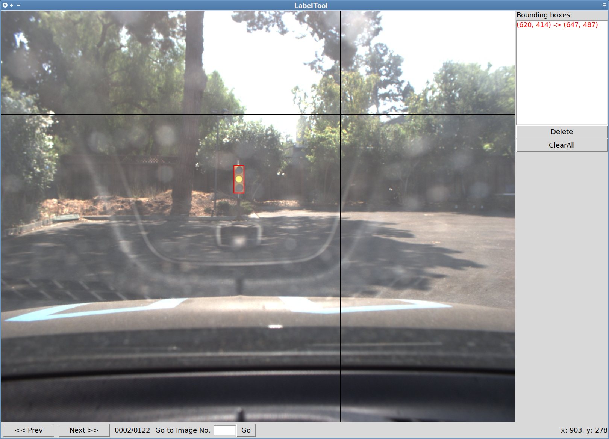

bbox-label-tool
===============

A simple tool for labeling object bounding boxes in images, implemented with
Python Tkinter. The tool was originally written by [Shi Qiu][1]. Cleaned
up a bit and "unixified" by [Lukasz Janyst](https://jany.st). Just copy it
to your `PATH` and run in the directory containing the image files.

[1]: https://github.com/puzzledqs/BBox-Label-Tool
